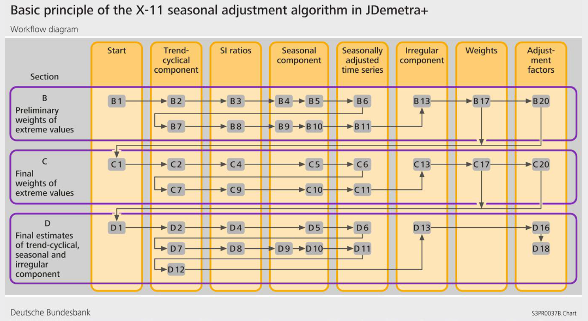

```{r setup, include=FALSE}
options(xtable.comment = FALSE)
library(ggplot2)
library(reshape2)
beamer_textwidth <- 11.13435
beamer_textheight <- 7.89807
conv_cm_to_in <- 0.393701
conv_cm_to_px <- 75
knitr::opts_chunk$set(echo = FALSE, fig.pos = 'H',message=FALSE,
                      fig.height = beamer_textheight * conv_cm_to_in,
                      fig.width =  beamer_textwidth * conv_cm_to_in)
```

### Objectifs de cette séquence

Cette séquence a pour objectif de vous présenter les concepts de base relatifs à la méthode X13-ARIMA.  


Après cette séquence vous saurez :  

- les vocabulaires relatifs à la méthode X13-ARIMA  

- la structure de la méthode X13-ARIMA en deux étapes   

- le fonctionnement et la finalité de la phase de pré-ajustement   

- le principe de la décomposition

### Questions de positionnement

Quels usages de la phase de pré-ajustement dans la méthode X13-ARIMA ?
\vfill

Quels sont les Outliers les plus couramment détectés ?
\vfill

À quoi sert un modèle ARIMA dans la méthode X13-ARIMA ?
\vfill

Qu'est ce que X11 ?
\vfill

Qu'est ce que le principe itératif dans la décomposition ?
\vfill

### X13-ARIMA

X pour eXperience…  

Deux modules :   

- REG-ARIMA : phase de pré-ajustement  
Correction préalable par régression linéaire des points aberrants, ruptures de tendance, effets de calendrier.  

Modélisation ARIMA : pour prolonger la série brute afin de résoudre partiellement le problème des fins de série lié aux moyennes mobiles symétriques.


- X11 : phase de décomposition  

Décomposition de la série en tendance-cycle, saisonnalité et irrégulier, à l'aide de moyennes mobiles.


# Phase de pré-ajustement : modèle Reg-ARIMA
## Série linéarisée

### Linéariser la série

Les moyennes mobiles, comme les modèles ARIMA, sont des opérateurs linéaires. Il faut donc préalablement **supprimer les « non-linéarités »** des séries (points aberrants, effets de calendrier, ruptures…)

Par régression linéaire sur les :

- outliers (points aberrants et ruptures)  
- effets de calendrier \faArrowCircleRight{} séquence de demain matin  
- autres régresseurs éventuels (ex : température moyenne, vacances scolaires…)  

Série linéarisée = $\left(Y_t - \sum \hat{\alpha_i}X_{it}\right)$ où les $X_i$ modélisent les « non-linéarités »

## Outliers et autres régresseurs

### Les principaux types d'outliers

\smallskip

\begin{columns}
\begin{column}{0.6\textwidth}
\textbf{Choc ponctuel}

\emph{Additive outlier} (AO)

Affecte l'Irrégulier
\end{column}
\begin{column}{0.3\textwidth}
\input{img/AO.tex}
\end{column}
\end{columns}

\begin{columns}
\begin{column}{0.6\textwidth}
\textbf{Changement de niveau}

\emph{Level Shift} (LS)

Affecte la Tendance
\end{column}
\begin{column}{0.3\textwidth}
\input{img/LS.tex}
\end{column}
\end{columns}

\begin{columns}
\begin{column}{0.6\textwidth}
\textbf{Changement de niveau transitoire}

\emph{Transitory Change} (TC) 

Affecte l'Irrégulier
\end{column}
\begin{column}{0.3\textwidth}
\input{img/TC.tex}
\end{column}
\end{columns}

\begin{columns}
\begin{column}{0.6\textwidth}
\textbf{Rupture de profil saisonnier}

\emph{Seasonal Outlier} (SO) 

Affecte la Composante Saisonnière
\end{column}
\begin{column}{0.3\textwidth}
\input{img/SO.tex}
\end{column}
\end{columns}


### Autres outliers *atypiques*

\smallskip

\begin{columns}
\begin{column}{0.6\textwidth}
\textbf{Effet de rampe}

\emph{Ramp effect} (RP) 
\end{column}
\begin{column}{0.3\textwidth}
\input{img/Ramp.tex}
\end{column}
\end{columns}

\begin{columns}
\begin{column}{0.6\textwidth}
\textbf{Rupture en niveau temporaire}

\emph{Temporary level shift} (TLS) 
\end{column}
\begin{column}{0.3\textwidth}
\input{img/TLS.tex}
\end{column}
\end{columns}

\begin{columns}
\begin{column}{0.6\textwidth}
\textbf{Changement en niveau atteint après une alternance entre des périodes de sur et sous-amortissement}
\end{column}
\begin{column}{0.3\textwidth}
\input{img/IV.tex}
\end{column}
\end{columns}

\begin{columns}
\begin{column}{0.6\textwidth}
\emph{Pure seasonal outlier} (PSO) 
\end{column}
\begin{column}{0.3\textwidth}
\input{img/PSO.tex}
\end{column}
\end{columns}


### Variables de régression associées aux outliers
\footnotesize

\begin{columns}
\begin{column}{0.45\textwidth}
\begin{align*}
&AO_t^{t_0} = \begin{cases}
1 & t=t_0 \\
0 & t\ne t_0
\end{cases}
\phantom{\begin{cases}
\\ \\ \\
\end{cases}}
\\
&LS_t^{t_0} = \begin{cases}
-1 & t<t_0 \\
0 & t\geq t_0
\end{cases}
\phantom{\begin{cases}
\\ \\ \\
\end{cases}}
\\
&TC_t^{t_0} = \begin{cases}
0 & t<t_0 \\
\alpha^{t-t_0} & t\geq t_0
\end{cases}
\\
&\text{avec }\alpha\in]0,1[\text{ ($\alpha=0,7$ par défaut)}&
\\
&SO_t^{t_0} = \begin{cases}
1 & t<t_0 \text{, $t$ même mois que }t_0\\
-\frac{1}{s-1} & t < t_0\text{, $t$ autre mois que }t_0 \\
0 & t\geq t_0
\end{cases}
\\
&\text{avec $s$ la périodicité de la série}&
\end{align*}
\end{column}

\begin{column}{0.45\textwidth}
\begin{align*}
RP_t^{(t_0,t_1)}&=
\begin{cases}
-1 & t\geq t_0 \\
-\frac{t-t_0}{t_1-t_0}-1 & t_0< t < t_1 \\
0 & t \leq t_1
\end{cases}
\\
TLS_t^{(t_0,t_1)}&=
\begin{cases}
0 & t < t_0 \\
1 & t_0 \leq t \leq t_1 \\
0 & t > t_1
\end{cases}
\\
IV_t^{t_0} &=\begin{cases}
-1 & t<t_0 \\
0 + (-\alpha)^{(t - t_0)} & t\geq t_0
\end{cases}
\\
&
\\
 PSO_t^{(t_0,j)} &=\begin{cases}
1 & \text{$t$ même mois que $j$, }t<t_0 \\
0 & \text{$t$ autre mois que $j$ ou }t \geq t_0 \\
-1 & \text{$t$ même mois que $t_0$, }t < t_0
\end{cases}
\\
&
\end{align*}
\end{column}
\end{columns}


### Outliers : résumé graphique
\input{img/outliers.tex}


## Modèle ARIMA

### La modélisation Reg-ARIMA
Le modèle Reg-ARIMA :
$$
\left(Y_t - \sum \hat{\alpha_i}X_{it}\right) \sim ARIMA(p,d,q)(P,D,Q)
$$
où les $X_i$ modélisent les « non-linéarités »

Le modèle ARIMA capture toute l'information temporelle, le résidu du modèle Reg-ARIMA est un bruit blanc  

Le modèle ARIMA est utilisé pour faire la prévision sur la série linéarisée  

La structure du modèle Reg-ARIMA, ainsi que sa détermination seront vues en détail lors du module « avancé »


# Phase de décomposition (X11)
## Les moyennes mobiles 
### Les moyennes mobiles (1/2)
La décomposition X11 utilise les filtres que sont les moyennes mobiles

**Une MM est un opérateur linéaire :**  
Linéarité : $M(X_t+Y_t) = M(X_t)+M(Y_t)$  

**3 types de MM utilisés par X11 :**

1. Moyennes mobiles simples (pour extraire la tendance) $\rightarrow M_{2\times 12}$

    + conserve la tendance linéaire (locale) : $M (at+b)=at+b \implies M (TC_t)\simeq TC_t$
    
    + élimine la saisonnalité stable : $M (S_t)=0$ 
    
    + réduit le bruit :  $\mathbb V \big[M (I_t)\big] \ll \mathbb V \big[I_t\big] \implies M (I_t)\simeq 0$


### Les moyennes mobiles (2/2)


2. Moyennes mobiles de Macurves (pour extraire la saisonnalité) $\rightarrow M_{3\times 5}$

    + réduit le bruit  
    
    + conserve la saisonnalité stable : $M (S_t)= S_t$  

3. Moyennes mobiles de Henderson (pour extraire la tendance) $\rightarrow H_{13}$

    + conserve la tendance polynomiale (ordre 3) : $M (at^3+bt^2+ct+d)=at^3+bt^2+ct+d$ 
    
    + n'élimine pas la saisonnalité : $M (S_t) \ne 0$ et $M (S_t) \ne S_t$
    
    + réduit le bruit au maximum  

## Le principe itératif de X11

### Principe itératif de X11 (1/2)
Une première estimation de la CVS : 

1. Estimation de la **tendance-cyle** par moyenne mobile $2\times 12$ :
$$
TC_t^{(1)}=M_{2\times 12}(X_t)
$$
2. Estimation de la composante **saisonnier-irrégulier** : 
$$
(S_t+I_t)^{(1)}= X_t - TC_t^{(1)}
$$
3. Estimation de la composante **saisonnière** par moyenne mobile $3\times 3$ sur **chaque mois** :
$$
S_t^{(1)}= M_{3\times 3}\left[(S_t+I_t)^{(1)}\right]
\text{ et normalisation }
Snorm_t^{(1)}=S_t^{(1)} - M_{2\times 12}\left(S_t^{(1)}\right)
$$
4. Estimation de la série corrigée des variations saisonnières : 
$$
Xsa_t^{(1)}= (TC_t+I_t)^{(1)} = X_t - Snorm_t^{(1)}
$$

### Principe itératif de X11 (2/2)
Une seconde estimation de la CVS : 

1. Estimation de la **tendance-cyle** par moyenne de Henderson (généralement 13 termes) :
$$
TC_t^{(2)}=H_{13}(Xsa_t^{(1)})
$$
2. Estimation de la composante **saisonnier-irrégulier** : 
$$
(S_t+I_t)^{(2)}= X_t - TC_t^{(2)}
$$
3. Estimation de la composante **saisonnière** par moyenne mobile $3\times 5$ (généralement) sur **chaque mois** :
$$
S_t^{(2)}= M_{3\times 5}\left[(S_t+I_t)^{(2)}\right]
\text{ et normalisation }
Snorm_t^{(2)}=S_t^{(2)} - M_{2\times 12}\left(S_t^{(2)}\right)
$$
4. Estimation de la série corrigée des variations saisonnières : 
$$
Xsa_t^{(2)}= (TC_t+I_t)^{(2)} = X_t - Snorm_t^{(2)}
$$

## Les étapes X11

### Les étapes de X11 
7 grandes étapes A à G  

**Étape A :** ajustements préalables (n'est plus utile)  

**Étapes B et C :** corrections automatiques (sur l'Irrégulier)  

**Étape D :** désaisonnalisation finale  

**Étapes E, F et G :** indicateurs et graphiques pour juger de la qualité de la décomposition (n'est plus utile avec JDemetra+)


### Les corrections automatiques de X11 (2/2)

Il existe un algorithme de détection et de correction des outliers et des effets de calendrier dans X11, **indépendant du module reg-ARIMA**.  

Ces détections sont faites sur la **composante irrégulière**.  

Elles s'effectuent dans les étapes B, C et D.  

Quand on n'autorise pas la correction des outliers dans la phase de pré-ajustement, X11 le fait quand même dans la phase de décomposition, avec pour conséquences :

- moins de visibilité et de maîtrise sur les outliers, leur nombre et leur nature (AO, LS ou TC) ;  

- la prévision du modèle Reg-ARIMA sera moins précise.


###  Les corrections automatiques de X11 (2/2)

Étape 1 : calcul d'un écart-type mobile de l'irrégulier sur des intervalles de 5 ans

- Tout point $I_t$ de l'année centrale telle que $\lvert I_t - m\rvert >2,5 \sigma_t$ est considéré comme aberrant et « supprimé »

- On recalcule l'écart-type (estimation plus robuste)


Étape 2 : On affecte un poids à chaque $I_t$ en fonction du $\sigma$ associé (l'année centrale étant l'année de $t$)

\centering
\includegraphics[height=3.5cm]{img/correction_auto_X11.png}


###  Bilan des étapes de X11

\centering

{width=100%}

# Conclusion

### Les essentiels

- X13-ARIMA travaille en deux phases : pré-ajustement et décomposition  

- Le pré-ajustement linéarise (par régression) et prolonge les séries en faisant des prévisions (par modèle ARIMA)  

- La décomposition X11 estime la composante Saisonnière  

- X11 utilise plusieurs moyennes mobiles ayant des propriétés complémentaires, de manière successive et itérative : principe itératif de X11


