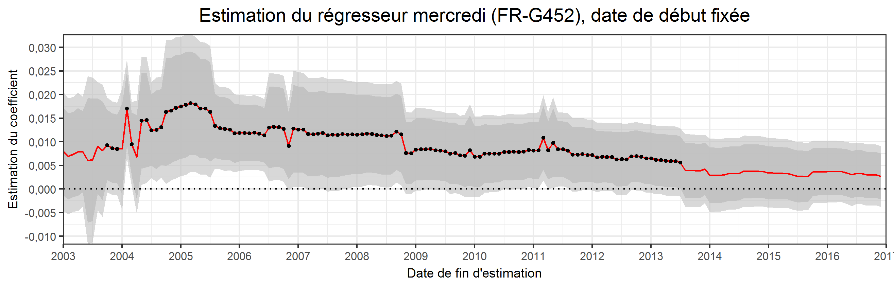

```{r setup, include=FALSE}
library(ggplot2)
library(grid)
library(gridExtra)
library(xtable)
beamer_textwidth <- 11.13435
beamer_textheight <- 7.89807
conv_cm_to_in <- 0.393701
conv_cm_to_px <- 75
knitr::opts_chunk$set(echo = FALSE, fig.pos = 'H',message=FALSE,
                      fig.height = beamer_textheight * conv_cm_to_in,
                      fig.width =  beamer_textwidth * conv_cm_to_in)
```


### Questions de positionnement

Quelles sont les hypothèses sur les résidus du modèle regARIMA et sont-elles importantes ?
\vfill

Avoir plus de données permet-il d'améliorer l'estimation du modèle regARIMA ?
\vfill

Quelle est la longueur optimale pour l'estimation d'un modèle ?


# Problèmes liés à la qualité des résidus

## Les hypothèses sur les résidus du modèle regARIMA

### Les hypothèses sur les résidus

Les estimations du modèle regARIMA sont **consistantes** (convergent et sans biais) et **efficaces** (de variance minimale), si les résidus $\varepsilon_t$ sont :

- *décorrélés* : $\forall t\ne t'\::\:\cov{\varepsilon_t,\varepsilon_{t'}}=0$ (*autocorrélés* sinon)  
- *homoscédastiques* : $\forall t, t'\::\:\V{\varepsilon_t}=\V{\varepsilon_{t'}}$ (*hétéroscédastiques* sinon)  
- distribuées selon une *loi normale*

### Conséquences des problèmes sur les résidus

\begin{table}[ht]
\centering
\begingroup\footnotesize
\begin{tabular}{|m{2.1cm}|m{1.8cm}|m{2.5cm}|m{3cm}|}
  \hline
Problème sur les résidus & Estimation des coefficients & Estimation de la variance des coefficients (pour tests de significativité) & Tests invalidés \\ 
  \hline
Autocorrélation & biaisée & biaisée &-- Student
\newline{} -- Hétéroscédasticité
\newline{} -- Normalité
\newline{} -- Qualité des prévisions \\ 
   \hline
Heteroscédasticité & non biaisée & biaisée &--  Student
\newline{} -- Normalité
\newline{} -- Qualité des prévisions \\ 
   \hline
Normalité & non biaisée & non biaisée &-- Student
\newline{} -- Qualité des prévisions \\ 
   \hline
\end{tabular}
\endgroup
\end{table}


### Sources des problèmes de spécification des résidus
L'autocorrélation des résidus peut provenir :

- d'erreurs de mesure : si les données sont interpolées toujours à la même date, un biais systématique peut être observé  
- problème de variable omise : il manque une variable explicative importante  
- mauvaise spécification : par exemple dans le cas d'une équation non linéaire mais polynomiale   
- effet de l'habitude : biais systématique du fait de l'optimisme  
- d'un lissage artificiel des données trimestrielles sur données annuelles  

\bcinfo L'autocorrélation peut souvent être corrigé en augmentant l'ordre AR mais elle peut aussi provenir de la présence de certains points atypiques (LS, SO)

\bcinfo Les points atypiques affectent l'hétéroscédasticité (AO, TC) et la non-normalité

## Exemple sur une série de l'IPI 

### Exemple (1/4)

```{r, include=FALSE}
#Pas utile de générer les graphiques à chaque fois 

# data <- structure(c(242.1719987, 227.0257411, 258.3759522, 219.7663649,
#                     215.3293739, 239.7752617, 241.401814, 216.1512819, 249.1607212,
#                     275.9632076, 254.3728642, 201.3948373, 267.4113329, 248.0513525,
#                     257.858105, 247.9721893, 238.5930086, 246.1788174, 254.8275274,
#                     180.3721444, 268.2410956, 266.2103025, 224.7370909, 183.3539834,
#                     262.1572089, 240.2970894, 263.3601565, 250.8566667, 220.6981555,
#                     240.0177958, 235.8825424, 162.9185503, 240.421211, 222.0256929,
#                     215.9843633, 176.2279111, 204.8115139, 229.2035436, 246.8716538,
#                     226.0172932, 199.2644251, 229.3665819, 234.7539126, 168.9136496,
#                     257.4275826, 219.9430775, 204.2104548, 180.277419, 223.4617806,
#                     195.0049506, 254.0115655, 201.5053006, 230.0498099, 237.0408038,
#                     214.7408583, 172.9492276, 237.1943953, 229.3678524, 210.2387904,
#                     171.1775255, 224.738021, 211.2476556, 237.7594233, 216.5007034,
#                     226.2187358, 233.4825389, 214.5123699, 170.6072988, 244.928739,
#                     220.6242886, 213.0553796, 151.103423, 212.222825, 201.289971,
#                     194.1235788, 196.4333717, 195.73798, 192.5141593, 215.3696644,
#                     146.4918473, 215.6716645, 231.0885627, 186.2392252, 166.7314019,
#                     192.3134639, 196.926785, 204.216077, 242.4222169, 190.5069787,
#                     208.7307015, 211.0618164, 144.4181667, 234.5689242, 234.3168359,
#                     205.377055, 179.5560008, 190.0314349, 190.7928671, 225.4802816,
#                     196.0224754, 163.4523272, 199.8742718, 203.5733983, 135.3451501,
#                     231.4866906, 169.6034578, 178.2564853, 154.4178265, 166.4269176,
#                     167.5984048, 200.3177533, 190.9954205, 180.9236792, 208.8389874,
#                     201.7708081, 151.617981, 241.1502089, 201.3593761, 179.4985705,
#                     161.8988536, 182.4037779, 181.02316, 209.5429047, 171.0042795,
#                     192.9283009, 200.3076255, 201.612761, 181.234621, 224.8208162,
#                     222.4603225, 198.5425683, 143.0978137, 196.1851513, 187.4853059,
#                     214.4020926, 165.2849626, 182.6011763, 200.9445478, 202.0451978,
#                     146.5461358, 203.1492618, 190.1672112, 172.4230943, 134.172986,
#                     177.5440352, 186.1986239, 186.5607134, 189.1208387, 189.1783828,
#                     182.7469712, 190.6175807, 140.0341269, 190.6512969, 189.9345225,
#                     165.1919541, 131.3365289, 179.2878733, 183.0122285, 204.3495485,
#                     202.0600436, 180.4060606, 183.3711888, 199.7446225, 140.0926845,
#                     203.068959, 204.5226792, 171.3664062, 151.1733335, 183.8808297,
#                     203.7785733, 209.3212515, 211.2028273, 184.2109864, 209.078277,
#                     194.4856044, 149.7144449, 201.7322362, 180.1529736, 183.3733823,
#                     152.1252808, 176.5658136, 158.6890832, 185.6787245, 184.8110801,
#                     164.5859103, 201.0944694, 185.5691193, 149.0017734, 190.2785668,
#                     182.606644, 188.9423009, 150.4875029, 179.8852004, 174.2968994,
#                     196.6692124, 174.0705326, 181.5959984, 189.9497572, 171.9491171,
#                     154.7470584, 173.579377, 182.9369111, 183.738624, 153.8442683,
#                     180.3773169, 174.4324643, 206.9412555, 195.1455034, 179.8264577,
#                     181.0638225, 194.5356097, 158.2303424, 195.0448929, 205.221583,
#                     188.2002572, 137.989261, 196.9811298, 196.683905, 187.5195961,
#                     204.4958934, 172.7596535, 189.6599347, 200.5697988, 156.3124355,
#                     182.2038592, 195.9590535, 161.8508486, 106.9443906, 133.2846386,
#                     155.9644947, 166.4215979, 160.5304175, 148.392074, 162.9912088,
#                     174.1609547, 121.7683417, 169.936841, 160.3877575, 141.8484203,
#                     108.1971096, 119.081819, 149.999521, 172.0949605, 163.5078509,
#                     150.5959231, 177.4186604, 175.412209, 141.856668, 178.9279532,
#                     157.7288643, 155.8390591, 115.5330074, 161.1235551, 160.1368005,
#                     192.6263457, 160.4414813, 163.1205335, 151.6478823, 170.1237753,
#                     142.2133741, 166.0505097, 161.1333845, 152.9648291, 104.0652258,
#                     151.1703102, 107.2098902, 133.8611514, 128.2835378, 115.6370574,
#                     137.1641549, 128.0242756, 82.48077581, 125.425776, 133.3031531,
#                     115.7008531, 89.5498474, 115.1905359, 105.4303155, 105.7898467,
#                     117.8610586, 102.3390786, 104.5879878, 117.4984038, 67.44813734,
#                     109.6634143, 113.5771237, 94.36224791, 80.08833016, 107.1468508,
#                     102.9712218, 113.590629, 116.0892249, 98.25086818, 109.8123488,
#                     114.6003888, 62.96194364, 106.3659942, 101.69451, 84.63792995,
#                     68.22623499, 99.28479294, 91.95145944, 111.0667585, 114.4471084,
#                     97.13482526, 113.399518, 116.7740248, 74.47932248, 110.6613859,
#                     101.272937, 92.93887735, 76.58898997, 99.06263086, 99.34830054,
#                     93.42185457, 101.7520211, 95.5501994, 108.2529365, 89.21490177,
#                     75.07860071, 118.067817, 93.35244714, 95.1865448, 71.34688282,
#                     93.37699053, 93.79083716, 117.2194331, 103.1895363, 108.7892955,
#                     119.5479286, 112.2722645, 89.49341352, 106.1691647, 111.9459362,
#                     108.8532337, 72.75798447, 104.7357604, 100.5342247, 113.2071905,
#                     107.779312, 104.3172159, 111.8638575, 116.0667593, 84.62697584,
#                     107.4517478, 113.791927, 103.4935746, 74.55896632, 224.106, 227.714,
#                     231.779, 221.278, 208.853, 237.677, 233.314, 276.491, 234.029,
#                     251.909, 251.426, 269.619, 245.027, 249.579, 241.685, 241.768,
#                     241.788, 242.878, 238.255, 242.104, 242.795, 238.828, 236.08,
#                     236.995, 244.098, 236.442, 237.268, 239.367, 229.175, 228.513,
#                     225.508, 215.533, 208.518, 209.289, 221.074, 213.862, 204.977,
#                     233.545, 216.596, 217.972, 198.791, 211.425, 232.94, 216.288,
#                     220.63, 215.083, 210.262, 213.623, 216.875, 199.884, 222.246,
#                     203.604, 223.37, 216.781, 222.847, 220.067, 205.106, 221.17,
#                     211.101, 210.391, 213.13, 217.955, 211.555, 224.807, 218.553,
#                     222.939, 215.316, 214.957, 221.904, 202.815, 205.489, 196.409,
#                     202.831, 193.384, 189.308, 191.478, 198.189, 191.064, 195.663,
#                     196.751, 190.806, 201.142, 194.677, 205.714, 186.677, 206.128,
#                     204.036, 229.852, 197.48, 198.707, 193.17, 197.831, 199.662,
#                     204.979, 213.772, 214.576, 196.078, 200.937, 209.868, 190.07,
#                     174.111, 188.511, 187.277, 177.913, 193.803, 155.052, 181.787,
#                     179.29, 177.437, 176.611, 178.634, 188.107, 187.417, 188.77,
#                     192.895, 190.908, 199.323, 193.258, 185.464, 187.688, 189.022,
#                     177.111, 185.061, 179.04, 185.578, 194.689, 196.632, 221.786,
#                     198.346, 206.304, 195.322, 190.502, 195.877, 193.123, 196.963,
#                     164.481, 180.923, 196.47, 184.621, 179.923, 186.058, 172.046,
#                     175.106, 180.315, 174.785, 188.827, 178.964, 178.951, 195.17,
#                     177.73, 169.794, 179.578, 172.246, 171.455, 176.808, 170.364,
#                     178.436, 183.325, 195.597, 187.472, 190.011, 177.122, 181.778,
#                     182.298, 182.62, 187.935, 180.238, 189.704, 191.459, 196.966,
#                     186.496, 194.708, 186.719, 189.571, 188.578, 180.731, 181.787,
#                     180.512, 186.952, 179.904, 180.43, 159.284, 168.458, 173.388,
#                     160.366, 180.82, 189.288, 176.907, 176.238, 180.694, 186.761,
#                     187.035, 177.964, 175.716, 174.644, 172.649, 178.872, 178.889,
#                     169.493, 180.554, 168.963, 172.964, 175.465, 207.42, 178.01,
#                     175.722, 191.228, 188.274, 181.595, 173.903, 177.837, 185.225,
#                     193.404, 186.33, 185.427, 189.171, 193.14, 186.925, 183.289,
#                     185.864, 180.99, 180.054, 178.624, 195.533, 167.566, 176.365,
#                     169.218, 141.193, 138.759, 156.274, 151.807, 149.35, 159.107,
#                     153.901, 155.409, 146.891, 154.38, 149.802, 144.793, 141.095,
#                     126.125, 150.314, 152.093, 154.195, 156.704, 161.079, 162.342,
#                     167.186, 159.83, 153.264, 160.052, 149.463, 163.701, 161.386,
#                     169.079, 157.975, 154.014, 145.22, 165.12, 168.179, 149.707,
#                     155.823, 154.135, 141.494, 148.354, 101.83, 123.741, 123.044,
#                     118.402, 129.551, 112.791, 99.513, 121.032, 120.402, 116.603,
#                     129.406, 111.062, 108.439, 101.921, 108.05, 105.589, 100.204,
#                     100.649, 86.926, 101.865, 102.05, 101.475, 110.928, 105.635,
#                     106.628, 108.136, 104.787, 102.623, 103.763, 99.573, 84.093,
#                     95.87, 93.12, 91.132, 91.32, 103.92, 95.533, 101.099, 102.001,
#                     103.477, 99.861, 102.718, 96.308, 99.39, 97.563, 97.616, 99.193,
#                     106.97, 97.162, 82.701, 93.988, 92.406, 93.19, 86.092, 93.256,
#                     107.139, 93.544, 97.661, 95.471, 94.597, 97.722, 101.556, 100.73,
#                     104.347, 107.025, 105.398, 109.546, 101.464, 107.929, 107.315,
#                     104.878, 105.685, 104.755, 102.432, 101.684, 102.141, 102.066,
#                     101.971, 104.694, 105.156, 105.848, 104.561, 106.972, 221.488,
#                     227.07, 232.689, 220.192, 214.859, 234.799, 230.933, 277.135,
#                     233.533, 252.354, 252.106, 271.273, 245.196, 248.97, 238.981,
#                     241.061, 243.366, 243.174, 239.211, 241.015, 244.426, 238.889,
#                     234.35, 236.377, 243.474, 236.61, 236.69, 239.097, 232.215, 227.303,
#                     225.985, 215.856, 207.839, 210.204, 223.87, 214.623, 202.676,
#                     233.081, 217.092, 217.369, 198.014, 211.13, 234.154, 217.089,
#                     222.861, 212.705, 207.458, 213.175, 216.467, 199.346, 222.664,
#                     201.888, 224.479, 219.124, 218.444, 218.251, 206.284, 221.872,
#                     211.408, 212.781, 213.814, 217.122, 211.984, 222.375, 217.159,
#                     220.946, 216.974, 216.005, 221.379, 202.032, 206.529, 192.475,
#                     201.695, 194.384, 187.682, 191.443, 198.389, 190.728, 197.008,
#                     195.897, 190.978, 201.008, 192.766, 205.88, 187.987, 205.319,
#                     201.9, 230.892, 197.104, 200.355, 190.698, 196.523, 200.003,
#                     204.883, 212.853, 213.41, 196.247, 200.292, 209.988, 190.436,
#                     175.564, 187.703, 187.335, 178.027, 191.645, 155.723, 183.671,
#                     180.432, 177.012, 176.138, 179.718, 188.134, 185.728, 189.11,
#                     193.216, 191.386, 199.877, 191.188, 182.756, 187.534, 189.748,
#                     175.957, 186.491, 177.604, 185.846, 191.113, 197.324, 222.459,
#                     197.219, 205.762, 196.41, 186.663, 194.236, 192.488, 199.739,
#                     164.585, 183.143, 194.562, 182.947, 180.098, 184.572, 172.29,
#                     175.379, 181.719, 175.337, 188.149, 179.31, 179.308, 193.623,
#                     178.145, 170.471, 178.684, 172.159, 171.428, 175.514, 170.112,
#                     178.462, 182.789, 198.762, 185.462, 188.884, 175.803, 179.16,
#                     181.168, 182.857, 187.974, 180.056, 188.009, 190.172, 195.358,
#                     188.906, 194.472, 185.563, 189.118, 188.884, 181.609, 182.347,
#                     178.679, 184.737, 178.985, 180.247, 159.026, 166.925, 174.706,
#                     162.747, 182.735, 184.951, 175.742, 176.897, 181.973, 187.166,
#                     188.102, 177.446, 175.17, 175.437, 170.667, 178.008, 177.588,
#                     170.647, 181.952, 169.22, 173.535, 176.359, 201.832, 174.463,
#                     174.792, 192.301, 187.671, 182.71, 174.609, 177.325, 186.459,
#                     193.977, 188.228, 185.278, 189.502, 190.628, 184.659, 180.932,
#                     186.668, 180.331, 182.174, 177.829, 195.877, 169.934, 177.864,
#                     168.302, 139.577, 135.222, 154.82, 151.186, 149.612, 160.051,
#                     153.404, 157.292, 149.214, 154.476, 151.604, 146.146, 141.432,
#                     122.336, 148.848, 152.106, 154.224, 154.976, 161.034, 164.594,
#                     171.808, 161.569, 152.317, 157.682, 149.008, 160.304, 159.999,
#                     168.72, 156.987, 158.695, 142.221, 162.799, 172.663, 150.428,
#                     156.623, 154.31, 143.066, 145.47, 100.965, 123.952, 123.064,
#                     118.033, 129.562, 112.723, 104.222, 120.299, 120.474, 116.807,
#                     130.537, 108.487, 107.958, 100.687, 108.258, 105.006, 99.766,
#                     102.152, 90.643, 102.127, 101.837, 100.556, 110.869, 102.218,
#                     106.29, 108.571, 103.769, 102.325, 102.553, 99.6, 86.996, 96.662,
#                     92.79, 90.558, 90.422, 99.498, 95.077, 101.351, 102.488, 102.548,
#                     100.902, 104.732, 99.315, 99.47, 97.685, 97.843, 98.78, 101.992,
#                     97.494, 82.264, 95.381, 92.485, 94.703, 86.005, 93.964, 109.016,
#                     93.795, 96.356, 94.981, 91.095, 96.749, 103.367, 100.609, 102.671,
#                     107.138, 108.753, 110.619, 103.066, 107.849, 105.812, 100.325,
#                     97.778, 100.437, 90.531, 91.766, 96.509, 89.324, 91.094, 124.399,
#                     93.845, 94.864, 99.58, 130.438), .Dim = c(348L, 3L), .Dimnames = list(
#                         NULL, c("y", "ARIMA(2,2,1)(1,1,1)", "ARIMA(0,1,1)(0,0,0)"
#                         )), .Tsp = c(1990, 2018.91666666667, 12), class = c("mts",
#                                                                             "ts", "matrix"))
# 
# dataGraph <- data.frame(cbind(time(data), data))
# colnames(dataGraph) <- c("date", colnames(data))
# 
# graph_y <- ggplot(dataGraph, aes(x = date))+
#     geom_line(data = dataGraph[dataGraph$date<=2017, ],
#               mapping = aes(y = y),colour="#287EB7")+theme_bw() +
#     scale_x_continuous(breaks = scales::pretty_breaks(n = 12)) +
#     labs(x=NULL,y=NULL,title = "IPI branche 0811 (série brute)")+
#     theme(plot.title = element_text(hjust = 0.5))
# graph_cvs <- ggplot(dataGraph, aes(x = date)) +
#     geom_line(data = dataGraph[dataGraph$date < 2018, ],
#               mapping = aes(y = `ARIMA(2,2,1)(1,1,1)`,colour = "ARIMA(2,2,1)(1,1,1)"),
#               )+
#     geom_line(data = dataGraph[dataGraph$date >= 2018, ],
#               mapping = aes(y = `ARIMA(2,2,1)(1,1,1)`,colour = "ARIMA(2,2,1)(1,1,1)"),
#               linetype="dashed")+
#     geom_line(data = dataGraph[dataGraph$date < 2018, ],
#               mapping = aes(y = `ARIMA(0,1,1)(0,0,0)`,colour = "ARIMA(0,1,1)(0,0,0)"),
#               )+
#     geom_line(data = dataGraph[dataGraph$date >= 2018, ],
#               mapping = aes(y = `ARIMA(0,1,1)(0,0,0)`,colour = "ARIMA(0,1,1)(0,0,0)"),
#               linetype="dashed")+
#     scale_colour_manual("",
#                         breaks = c("ARIMA(2,2,1)(1,1,1)", "ARIMA(0,1,1)(0,0,0)"),
#                         values = c("#F8766D", "#00BFC4"))+
#     theme_bw() +
#     scale_x_continuous(breaks = scales::pretty_breaks(n = 12)) +
#     labs(x=NULL,y=NULL,title = "IPI branche 0811 (séries CVS)")+
#     theme(plot.title = element_text(hjust = 0.5),
#           legend.justification = c(0,0),
#           legend.position = c(0,0))
# 
# ggsave(filename ="img/seq_3_ipi_0811_y.png", plot = graph_y,
#        width = beamer_textwidth*2, height = beamer_textheight*1.5,
#        units = "cm")
# ggsave(filename ="img/seq_3_ipi_0811_cvs.png", plot = graph_cvs,
#        width = beamer_textwidth*2, height = beamer_textheight*1.5,
#        units = "cm")
```

Un modèle ARIMA(0,1,1)(0,0,0) est-il plausible ?


{width=100%}

### Exemple (2/4)

Que peut-on dire sur les régresseurs JO ?

\centering 

{width=70%}


### Exemple (3/4)

Avec un modèle bien spécifié : 

\centering 

{width=70%}

### Exemple (4/4)

Quel impact sur ma série désaisonnalisée ?


{width=100%}

# Modèle regARIMA et séries longues

## Hypothèse de stabilité des coefficients

###  Hypothèse de stabilité du modèle regARIMA

Le modèle regARIMA est un modèle de régression linéaire. Il suppose :

- que les coefficients sont stables dans le temps  

- que la structure des résidus (modèle ARIMA) est constante dans le temps

\bctakecare Est-ce plausible ? Quelle est la durée nécessaire pour avoir une estimation *stable* ?

\faArrowCircleRight{} Étudions les estimations des régresseurs JO et la stabilité de la décision de CJO

## Exemples

### Ici estimation du leap year relativement stable...

{width=100%}

{width=100%}

### ... Mais pas le régresseur mercredi

{width=100%}

{width=100%}

### Estimations du LY pas toujours stable
Estimations du LY toujours non significatives avec estimations roulantes

{width=100%}

{width=100%}

### Cas compliqué (1/2) : EL G473

{width=100%}

### Cas compliqué (2/2) : estimations roulantes

{width=100%}


# Conclusion

### Les essentiels

- une bonne spécification des résidus est importante pour interpréter le modèle regARIMA

- résidus autocorrélés $\implies$ hétéroscédasticité $\implies$ non normalité

- attention aux séries longues : l'hypothèse de stabilité du modèle est généralement fausse pour les séries de plus de 20 ans

- attention aux séries courtes : les estimations sont généralement moins précisent (plus grande variance des estimateurs) et peuvent être fortement révisées

## Bibliographie

### Bibliographie  {.noframenumbering}

\footnotesize

\begin{thebibliography}{999}
\bibitem[Ladiray, Quartier-la-Tente (2018)]{LAQLT2018} Ladiray D., Quartier-la-Tente A. (2018), Du bon usage des modèles Reg-ARIMA en désaisonnalisation, Actes des 13\ieme{} Journées de Méthodologie Statistique, \url{http://www.jms-insee.fr/2018/S05_1_ACTEv3_QUARTIERLATENTE_JMS2018.pdf}.
\end{thebibliography}
