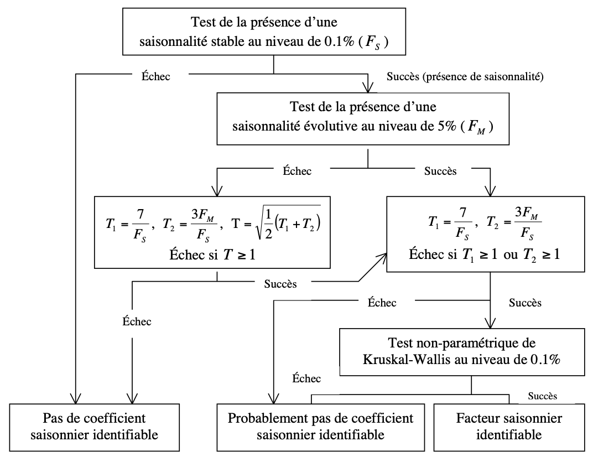

```{r setup, include=FALSE}
options(xtable.comment = FALSE)
library(ggplot2)
library(reshape2)
library(kableExtra)
beamer_textwidth <- 11.13435
beamer_textheight <- 7.89807
conv_cm_to_in <- 0.393701
conv_cm_to_px <- 75
knitr::opts_chunk$set(echo = FALSE, fig.pos = 'H',message=FALSE,
                      fig.height = beamer_textheight * conv_cm_to_in,
                      fig.width =  beamer_textwidth * conv_cm_to_in)
```

### Objectifs de cette séquence

Objectifs : définitions et propriétés des moyennes mobiles (MM) de X11.


Après cette séquence, vous saurez :  

- Les propriétés des MM  
- Identifier les moyennes mobiles utilisées par X11  
- Choisir d'autres MM que ceux par défaut

### Questions de positionnement

Que signifie une moyenne mobile centrée et symétrique ?
\vfill

Quelles sont les principales propriétés des moyennes mobiles ?
\vfill

Quel type de problème affecte le traitement de la fin de série ?
\vfill

Que représente le gain et le déphasage d'une moyenne mobile ?
\vfill

Quels indicateurs utilisés pour évaluer la qualité de la décomposition ?

# Introduction aux moyennes mobiles

## Définitions

### Les moyennes mobiles (1/2)
Moyenne mobile d'*ordre* $p+f+1$ de coefficients $(\theta_i)$, l'opérateur $M$ défini par :
$$
MX_t = \sum_{i=-p}^{f}\theta_i X_{t+i}
$$

Valeur en $t$ remplacée par une moyenne pondérée de $p$ valeurs passées, de la valeur courante et de $f$ valeurs futures.

Moyenne mobile simple (tous les coeffs égaux) d'ordre 3 :

$$
MX_t = \frac{1}{3}(X_{t-2}+X_{t-1}+ X_{t})
$$

### Les moyennes mobiles (2/2)
Si $p=f$, la moyenne mobile est dite *centrée*

Si, de plus $\theta_{-i} = \theta_i$, elle est dite *symétrique*

Remarque : une moyenne d'ordre pair ne peut être centrée et symétrique.

Construire une moyenne centrée et symétrique en combinant 2 moyennes d'ordre pair.

$$
\begin{rcases}
M_1X_t= \frac{1}{4}(X_{t-2}+X_{t-1}+X_{t}+X_{t+1}) \\
M_2X_t= \frac{1}{4}(X_{t-1}+X_{t}+X_{t+1}+X_{t+2})
\end{rcases} \rightarrow M_{2\times 4} = \frac{M_1+M_2}{2}
$$

Quelle serait la moyenne $M_{2\times 12}$ ?

Pourquoi une moyenne $M_{3\times 3}$ ?


## Gain et déphasage

### Fonction de gain, déphasage
Soit une série $X_t=R\sin(\omega t + \phi)$

La transformée de $X_t$ par une MM sera une sinusoïde d'amplitude modifiée et présentant un déphasage :
$$
M(X_t) = G(\omega)R\sin(\omega t + \phi + \Gamma(\omega))
$$
          
$G(\omega)=$ *Fonction de gain* de la moyenne mobile  
$\Gamma(\omega)=$ *Fonction de déphasage* de la moyenne mobile

Une MM symétrique n'introduit pas de déphasage !


### Exemple de gain et de déphasage

Lissage $X_t=\sin\left(\frac{\pi t}{3}\right)$ par $M(X_t)=\frac{X_{t-2}+X_{t-1}+X_{t}}{3}$ asymétrique :
$$
G(\omega) = \frac{1+2\cos(\omega)}{3} \qquad
\Gamma(\omega) = -\omega
$$

\begin{figure}[!ht]
\pgfplotsset{width=\textwidth,height=4cm,every axis legend/.append style={font=\footnotesize,
  at={(0.5,-0.1)},
  anchor=north}
    }
\begin{tikzpicture}
\begin{axis}[
xtick={0,3.14159,...,15.70795},
xticklabels={0,$\pi$,$2\pi$,$3\pi$,$4\pi$,$5\pi$} 
]
\addplot[domain=0:5*pi,smooth]    plot (\x,{sin(\x * (pi/2) r)});
\addplot[domain=0:5*pi,smooth, dashed]    
  plot (\x,{1/2*sin(\x* pi/2 r )+1/2*sin((\x -1) * pi/2 r)});
\draw[<->](axis cs: 1.5,1)--(axis cs: 1.5,0.7071068)
  node[pos=0.5, right]{\scriptsize $G_{\theta_0}(\pi/2)$};
\draw[<->] (axis cs: 3, -0.70710680-0.05)--(axis cs: 3.5,-0.7071068-0.05) 
  node[pos=0.5, below right]{\scriptsize $\Phi_{\theta_0}(\pi/2)$};
\end{axis}
\end{tikzpicture}
\end{figure}

## Construction et propriétés

### Construction de moyennes mobiles
Proprité évidente, la *linéarité* :
\begin{align*}
X_t &= TC_t+S_t + I_t\\
MX_t &=M(TC_t) + M(S_t) + M(I_t)
\end{align*}

Trois propriétés utiles pour la désaisonnalisation :

- P1 : conservation de la tendance $M(TC_t) = TC_t$  
- P2 : élimination de la saisonnalité $M(S_t) = 0$  
- P3 : réduction de l'irrégulier, $\V{M(I_t)}$ minimale


### P1 : Conservation des tendances

Toute MM **symétrique** qui conserve les constantes (resp. polynômes de degré 2d) conserve les droites (resp. polynômes de degré 2d+1)

La série résultante est linéaire par morceaux.

Les MM sont **sensibles aux points extrêmes** !

Exercice : les MM suivantes conservent-elles les droites ?
\begin{align*}
M_1[X_t]&=\frac{1}{3}(X_{t-1}+X_{t}+X_{t+1})\\
M_2[X_t]&=\frac{1}{4}(X_{t-2}+X_{t-1}+X_{t}+X_{t+1}) \\
M_3[X_t]&=\frac{1}{4}(X_{t-2}+2X_{t-1}2+X_{t}+2X_{t+1}+X_{t+2})
\end{align*}

Qu'en est-il des moyenne $M_{2\times 12}$ et $M_{3\times 3}$ ?

### P2 : Elimination de la saisonnalité

Élimination saisonnalités constantes = élimination fonctions périodiques.

\underline{À retenir :} Il suffit de choisir une MM simple d'ordre de la périodicité.

Exercice : montrer qu'une MM simple d'ordre 12 élimine les saisonnalités stables

Qu'en est-il de la moyenne $M_{2\times 12}$ ?


### P3 : Réduction du bruit (i.e. l'irrégulier)

On ne peut éliminer la composante irrégulière mais on peut l'atténuer. 

Une MM transforme un bruit blanc de variance $\sigma^2$ en un bruit de moyenne nulle, autocorrélé et de variance :
$$
\sigma^{*2}=\sigma^2\sum_{i=-p}^f\theta_i^2
$$
La quantité $\sum_{i=-p}^f\theta_i^2$ est le *pouvoir réducteur* de la moyenne mobile

Réduire le bruit \faArrowCircleRight{}  **minimiser la somme des carrés des coefficients**.  

Quel pouvoir réducteur des moyennes $M_{2\times 12}$ et $M_{3\times 3}$ ?

## Fin de période

### Le problème des fins de série
Une MM centrée d'ordre 2p+1 ne peut lisser les « p » premiers et les « p » derniers points

\underline{Solution 1 :} utiliser des MM asymétriques

Les MM asymétriques de MUSGRAVE permettent de minimiser les révisions (associées à celles d'Henderson)

\underline{Solution 2 :} prolonger la série par prévision et appliquer une MM symétrique

Les prévisions sont une combinaison linéaire du passé, ça reste asymétrique, mais mieux que MUSGRAVE.


### Les moyennes mobiles dans X11
- MM centrée d'ordre la périodicité de la série (2X12, 13 termes, pour les séries mensuelles) : conserve des droites, supprime une saisonnalité stable, faible pouvoir de lissage 

- MM de *Macurves* (asymétrique sur la fin de série), pour extraire la composante saisonnière : 3X3 (5 termes), 3X5 (7 termes), 3X9 et 3X15

- MM de *Henderson* (5, 7, 9, 13 ou 23 termes) : conserve des polynômes, bon pouvoir de lissage 

- MM de *Musgrave* tournent sur les prévisions

Choix de la longueur des filtres dépend des variations de l'irrégulier par rapport à celles de TC (Henderson) et de S (Macurves)

### Idée de la moyenne mobile de Henderson
Objectif : obtenir une estimation lisse de la tendance-cycle. Pour M une MM centrée d'ordre $2p+1$, $X_t = \begin{cases}
1 & \text{ si }t=0 \\
0 & \text{ si }t\ne 0
\end{cases}$ on a :

$$
MX_t = \begin{cases}
0 & \text{ si }t< -p\text{ ou }t>p \\
\theta_t & \text{ si } -p\leq t\leq p
\end{cases} \quad\text{lisse si courbe des coefficients lisse}
$$
Les MM de Henderson sont solution du programme :
$$
\begin{cases}
\displaystyle\min\limits_\theta \sum (\nabla^3 \theta_i)^2 \quad \text{ critère de "souplesse" de la courbe des coefficients} \\
\displaystyle\sum_{i=-p}^p\theta_i = 1,\, 
\sum_{i=-p}^pi\theta_i = 0, \,
\sum_{i=-p}^pi^2\theta_i = 0
\end{cases} 
$$


### Exemples des moyennes mobiles « classiques »

\centering

\includegraphics[height=0.8\paperheight]{img/moyennesmobiles}

## Filtre final X11

### Coefficients du filtre final de X11

Coefficients du filtre final pour extraire la CVS (cas séries mensuelles, Henderson 13 et Macurve $3\times 5$) : 42 mois = 3,5 ans et 84 mois = 7 ans.

\centering

\includegraphics[height=0.7\textheight, width = \textwidth]{img/seq2_MMfinale.png}


### Le gain du filtre X11 pour extraire la CVS
Le gain en fonction de la fréquence :

\centering

\includegraphics[height=0.7\textheight, width = \textwidth]{img/seq2_gain.png}

# Choix de la longueur de la MM

## Rappels sur le principe itératif de X11

### Principe itératif de X11 (1/2)
Une première estimation de la CVS : 

1. Estimation de la **tendance-cyle** par moyenne mobile $2\times 12$ :
$$
TC_t^{(1)}=M_{2\times 12}(X_t)
$$
2. Estimation de la composante **saisonnier-irrégulier** : 
$$
(S_t+I_t)^{(1)}= X_t - TC_t^{(1)}
$$
3. Estimation de la composante **saisonnière** par moyenne mobile $3\times 3$ sur **chaque mois** :
$$
S_t^{(1)}= M_{3\times 3}\left[(S_t+I_t)^{(1)}\right]
\text{ et normalisation }
Snorm_t^{(1)}=S_t^{(1)} - M_{2\times 12}\left(S_t^{(1)}\right)
$$
4. Estimation de la série corrigée des variations saisonnières : 
$$
Xsa_t^{(1)}= (TC_t+I_t)^{(1)} = X_t - Snorm_t^{(1)}
$$

### Principe itératif de X11 (2/2)
Une seconde estimation de la CVS : 

1. Estimation de la **tendance-cyle** par moyenne de Henderson (généralement 13 termes) :
$$
TC_t^{(2)}=H_{13}(Xsa_t^{(1)})
$$
2. Estimation de la composante **saisonnier-irrégulier** : 
$$
(S_t+I_t)^{(2)}= X_t - TC_t^{(2)}
$$
3. Estimation de la composante **saisonnière** par moyenne mobile $3\times 5$ (généralement) sur **chaque mois** :
$$
S_t^{(2)}= M_{3\times 5}\left[(S_t+I_t)^{(2)}\right]
\text{ et normalisation }
Snorm_t^{(2)}=S_t^{(2)} - M_{2\times 12}\left(S_t^{(2)}\right)
$$
4. Estimation de la série corrigée des variations saisonnières : 
$$
Xsa_t^{(2)}= (TC_t+I_t)^{(2)} = X_t - Snorm_t^{(2)}
$$

## Longueur du filtre de Henderson

### Ratio I/C

Choix du filtre de Henderson dépend du ratio $\bar I/\bar C$ qui mesure l'importance de l'irrégulier dans la série. $C=H_{13}(SA)$ et $I=SA\: op\: C$ avec $op=-\text{ ou }/$, et 
$$
\bar C=\frac{1}{n-1}\sum_{t}\lvert C_t\: op\:C_{t-1}-xbar \rvert\text{ avec }xbar=0\text{ ou } 1
$$


## Longueur du filtre de Macurves

### Ratio de saisonnalité mouvante (RSM/MSR)

Choix du filtre saisonnier basé sur le calcul du ratio I/S, qui mesure la part du bruit dans la composante S-I (également calculable par mois $j$)
$$
MSR = \frac{\sum_jn_j\bar I_j}{\sum_jn_j\bar S_j} \text{ avec }
\bar I_j=\frac{1}{n_j-1}\sum_{t}\lvert I_{t,j}\: op\:I_{t-1,j}-xbar \rvert
$$

Si zone B ou D, on enlève la dernière année et on recommence (au plus 5 fois, sinon M3X5)

\bcinfo L'étude des MSR peut révéler des mois à saisonnalité $\pm$ variables

# Diagnostics sur la qualité de la décomposition


## Les statistiques M

### Les statistiques M  (1/3)

\footnotesize

11 Statistiques, moyenne pondérée = statistique $Q$ ou $Q-M2$


```{r}
data_statm <- XLConnect::readWorksheetFromFile("Stat M.xlsx",sheet = 1,
                                               rownames = 1)
kbl(data_statm[1:5,], booktabs = TRUE,
    align = c("c","l","l","l"),escape = FALSE) %>% 
  kable_styling(latex_options = "striped")%>% 
  column_spec(3, width = "0.55\\\\textwidth")%>% 
  column_spec(4, width = "0.2\\\\textwidth")%>% kable_styling(position = "center")
```


### Les statistiques M  (2/3)

\footnotesize
```{r}
data_statm <- XLConnect::readWorksheetFromFile("Stat M.xlsx",sheet = 1,
                                               rownames = 1)
colnames(data_statm) <- gsub(".", " ", colnames(data_statm),fixed = TRUE)

# On enlève la colonne sur les poids courts
data_statm <- data_statm[,-4]
kbl(data_statm[-(1:5),], booktabs = TRUE,
    align = c("c","l","l","l"),escape = FALSE) %>% 
  kable_styling(latex_options = "striped")%>% 
  column_spec(3, width = "0.55\\\\textwidth")%>% 
  column_spec(4, width = "0.2\\\\textwidth")%>% kable_styling(position = "center")
```


### Les statistiques M  (3/3)


**M1 et M2** :  calibrées pour des séries dont le cycle contribue de 5 à 10 % à la variance totale : si pas de cycle peut dépasser 1 et si contribution du cycle > 10% alors le seuil devrait être plus grand que 1

\pause

**M3 et M5** : si tendance plate à ignorer,  important si on analyse les cycles économiques


\pause

**M4** échoue souvent (peut venir des CJO, de la collecte...) et indépendant des autres statistiques


\pause

**M8 et M10** : ignorer si l'on s'intéresse qu'aux estimations courantes 


\pause

**M9 et M11** : ignorer si l'on s'intéresse qu'aux estimations "historiques" 
 


### MSR et Calendarsigma

Hypothèse générale : la saisonnalité évolue au même rythme dans tous les mois, l'irrégulier est stationnaire... Pas toujours le cas :

- MSR peuvent être différents entre les mois \faArrowCircleRight{} filtres saisonniers mal adapté aux moix plus volatils (paramètre `x11.seasonalma`)

- variance de l'irrégulier peut être différente en fonction des mois (test de cochran) \faArrowCircleRight{} sur-correction des points atypiques sur certains mois (paramètre `x11.calendarsigma`)

\bclampe : l'étude des S-I ratio peuvent aider


## Sliding spans, révisions et stabilité du modèle

### Comparaison à travers différentes spécifications

Fenêtre `Diagnostics > Matrix` permet de comparer les résultats sur différentes spécifications :

- Créer des nouvelles spécifications

- Pour une matrice personnalisée : `Tools > Option > Custom matrix (diagnostics) > réduire la liste`

### Juger la fiabilité des estimations

::: {.block data-latex="{Sliding spans}"}
Objectif : juger de la fiabilité des estimations

Méthode : comparaison des estimations de la CVS-CJO sur différents intervalles (ex : [2007 - 2015], [2008 - 2016], [2009 - 2017], [2010 - 2018])
:::

::: {.block data-latex="{Révision}"}
Objectif : juger de la fiabilité des dernières estimations

Méthode : comparaison de la première et de la dernière estimation de la CVS-CJO sur les 4 dernières années
:::

::: {.block data-latex="{Model stability}"}
Objectif : juger de la fiabilité des estimations du modèle Reg-ARIMA

Méthode : comparaison des estimations des coefficients du modèle Reg-ARIMA
:::


## Tests de saisonnalité

### Tests de saisonnalité

\footnotesize\vspace{-1cm}

```{r,echo=FALSE}
data_tests <- XLConnect::readWorksheetFromFile("test saisonnalite.xlsx",sheet = 1)
kbl(data_tests, booktabs = TRUE, row.names = FALSE) %>% 
  kable_styling(latex_options = "striped")%>% 
  column_spec(1, width = "0.3\\\\textwidth")%>% 
  column_spec(2, width = "0.65\\\\textwidth")
```

\bcinfo Dans "Main results" : qs test effectué sur l'ensemble de la série et f-test sur 8 dernières années.  
"Residual seasonality" = test combiné

\bcattention Tests non effectués sur les séries finales !

### Test combiné, source : Ladiray et Quenneville (1999)

{height=90%}


### Les essentiels

X11 est une application successive de différentes MM ayant des fonctions spécifiques

Les 3 principales propriétés des MM : conservation des droites ou polynômes, suppression des fonctions périodiques et pouvoir réducteur du bruit

La finalité de X11 étant d'estimer les coefficients saisonniers par une très longue MM

Les CVS sur la fin de série sont déphasées

Importants de vérifier la qualité de la décomposition : statistiques M et saisonnalité résiduelle... mais dépendent de l'objectif !


### Bibliographie  {.noframenumbering}

\footnotesize

\begin{thebibliography}{999}
\bibitem[Données désaisonnalisées FAQ]{DocJD} Documentation de JDemetra+ \url{https://jdemetradocumentation.github.io/JDemetra-documentation/}

\bibitem[Kirchner et al (2018)]{K2018} Kirchner R., Ladiray D. et Mazzi G.L, Quality Measures and Reporting for Seasonal Adjustment, in Handbook on Seasonal Adjustment, edited by G. L. Mazzi, co-edited by D. Ladiray, European Union, Luxembourg. \url{ec.europa.eu/eurostat/web/products-manuals-and-guidelines/-/KS-GQ-18-001}.
\bibitem[Ladiray (2018)]{L2018} Ladiray D., et Quenneville B. (1999). Comprendre la méthode X11, \emph{Institut National de la Statistique et des Études Économiques}, \url{https://www.census.gov/pub/ts/papers/x11doc.pdf}

\bibitem[Palate (2014)]{P2014} De Antonio A. et Palate J. (2019), ‘JD+ Seasonality tests'. \url{https://github.com/palatej/ESTP}.

\bibitem[Findley (2014)]{Findley2017} 
Findley D. F., Lytras D. P. et McElroy, T. S. (2017). Detecting seasonality in seasonally adjusted monthly time series. \emph{Statistics}, 3, \url{https://www.census.gov/content/dam/Census/library/working-papers/2017/adrm/rrs2017-03.pdf}

\bibitem[Lytras 2007]{Lytras2007} Lytras D. P., Feldpausch R. M. et Bell W. R. (2007). Determining seasonality: a comparison of diagnostics from X-12-ARIMA. \emph{US Census Bureau}, \url{http://www.census.gov/ts/papers/ices2007dpl.pdf}.

 
\end{thebibliography}


