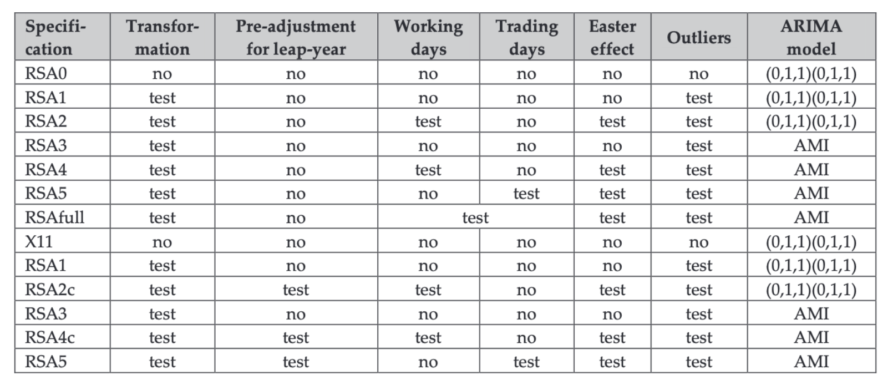

```{r setup, include=FALSE}
knitr::opts_chunk$set(echo = TRUE, fig.height = 5.8)
library(microbenchmark)
library(forecast)
library(ggplot2)
library(RJDemetra);library(ggdemetra);
os <- Sys.info()[["sysname"]]
if(!dir.exists("data"))
	dir.create("data")
if (os == "Windows") {
	if (!file.exists("data/x13_benchmark_windows.RDS")) {
	saveRDS(microbenchmark::microbenchmark("seasonal::seas" = seasonal::seas(co2, x11 = ""),
							   "RJDemetra::x13" = RJDemetra::x13(co2),
							   "RJDemetra::jx13" = RJDemetra::jx13(co2),
							   "rjd3x13::x13" = rjd3x13::x13(co2)),
			"data/x13_benchmark_windows.RDS")
}
} else {
	if (!file.exists("data/x13_benchmark_macos.RDS")) {
	saveRDS(microbenchmark::microbenchmark("seasonal::seas" = seasonal::seas(co2, x11 = ""),
							   "RJDemetra::x13" = RJDemetra::x13(co2),
							   "RJDemetra::jx13" = RJDemetra::jx13(co2),
							   "rjd3x13::x13" = rjd3x13::x13(co2)),
			"data/x13_benchmark_macos.RDS")
}
}
options(enable_print_style = FALSE)
```

### Objectifs de cette séquence

Présenter les principales méthodes de décomposition

### Questions de positionnement

Pourquoi désaisonnaliser une série ?

Quelles sont les principales méthodes décomposition ?

Quelles sont les différents schémas de décomposition ?

# Schéma de décomposition

### Rappels sur les différentes composantes

- Tendance-cycle : évolution de moyen/long terme de la série ($TC_t$)  
\faArrowCircleRight{} tendance et cycle estimés conjointement : évite problèmes de définition (limite entre cycles courts et longs ?) et difficultés sur séries courtes

- Saisonnalité et autres effets de calendrier (jours ouvrables, fêtes mobiles, etc.) $S_t$

- Irrégulier : composante d'erreur (idéalement faible) $I_t$

. . .

Objectif de la désaisonnalisation : enlever $S_t$ pour mieux analyser le signal conjoncturel et faire des comparaisons temporelles/spatiales

. . .

$Y_t = f(S_t,TC_t,I_t)$ : quelle relation entre les différentes composantes ?

### Les différents schémas de décomposition

- Schéma additif :
$$X_t = {TC}_t + S_t + I_t$$
- Schéma multiplicatif :
$$
X_t = {TC}_t \times S_t \times I_t
$$

- Schéma pseudo-additif (, suppose) :
$$
X_t = {TC}_t \times (S_t + I_t - 1)
$$
\faArrowCircleRight{} lorsque certains mois ont des valeurs très faibles, suppose saisonnalité et irrégulier indépendants

- Schéma log-additif :
$$
\log(X_t) = \log({TC}_t) + \log(S_t) + \log(I_t)
$$


# STL

### Seasonal and Trend decomposition using Loess (STL)

Application successive de Loess (régression locale robuste) et de moyennes mobiles

Avantages :

- Applicable sur toutes les fréquences

- Robuste aux points atypiques

Inconvénients :

- Pas de choix automatique du schéma de décomposition

- Pas de correction de jours ouvrables

- Pas de choix automatique des paramètres (longueur des filtres à spécifier)

### Exemple (1)

```{r, fig.height=6}
plot(nottem)
```

### Exemple (2)

```{r, fig.height=6}
plot(stl(nottem, s.window = 7))
```

### Exemple (3) : `autoplot`

```{r, fig.height=5.5}
library(forecast)
stl(nottem, s.window = 7) %>% autoplot()
```


# X-13-ARIMA et TRAMO-SEATS

### Méthodes utilisées dans les INS

Dans les INS, les méthodes principalement utilisées sont X-13-ARIMA et TRAMO-SEATS :

- Méthodes recommandées par Eurostat

- Permettent de faire des CJO et de prendre en compte les spécificités calendaires

- Choix automatique du schéma de décomposition (additive ou multiplicatif)

- Prise en compte de différents types de ruptures

- Applicables que sur des séries au plus mensuelles (travaux en cours pour étendre ces méthodes)


### Désaisonnalisation en deux modèles

1. Linéarisation de la série : correction des points aberrants, des ruptures et des effets calendriers par un modèle RegARIMA

2. Décomposition de la série linéarisée : par une méthode non-paramétrique (X-11, application successive de moyennes mobiles) ou paramétrique (SEATS)

### Les principaux types d'outliers

\smallskip

\begin{columns}
\begin{column}{0.6\textwidth}
\textbf{Choc ponctuel}

\emph{Additive outlier} (AO)

Affecte l'Irrégulier
\end{column}
\begin{column}{0.3\textwidth}
\input{img/AO.tex}
\end{column}
\end{columns}

\begin{columns}
\begin{column}{0.6\textwidth}
\textbf{Changement de niveau}

\emph{Level Shift} (LS)

Affecte la Tendance
\end{column}
\begin{column}{0.3\textwidth}
\input{img/LS.tex}
\end{column}
\end{columns}

\begin{columns}
\begin{column}{0.6\textwidth}
\textbf{Changement de niveau transitoire}

\emph{Transitory Change} (TC) 

Affecte l'Irrégulier
\end{column}
\begin{column}{0.3\textwidth}
\input{img/TC.tex}
\end{column}
\end{columns}

\begin{columns}
\begin{column}{0.6\textwidth}
\textbf{Rupture de profil saisonnier}

\emph{Seasonal Outlier} (SO) 

Affecte la Composante Saisonnière
\end{column}
\begin{column}{0.3\textwidth}
\input{img/SO.tex}
\end{column}
\end{columns}

### Package à utiliser

Pour X-13ARIMA deux packages peuvent être utilisés :

- `seasonal` basé sur les programmes du Census Bureau

- `RJDemetra` basé sur les JDemetra+ (logiciel recommandé par Eurostat)

TRAMO-SEATS : uniquement implémenté dans `RJDemetra`

### Comparaison des performances (1)

```{r,echo=FALSE,message=FALSE,warning=FALSE}
autoplot(readRDS("data/x13_benchmark_macos.RDS"), log = FALSE) + 
	ggtitle("Mac OS (Ordinateur personnel)")
```

### Comparaison des performances (2)

```{r,echo=FALSE,message=FALSE,warning=FALSE}
autoplot(readRDS("data/x13_benchmark_windows.RDS"), log = FALSE) + ggtitle("Windows (Ordinateur personnel)")
```


### Spécifications de base

```{r, echo=FALSE, out.width="100%"}

```

Paramètre `spec` dans `RJDemetra::x13()` et `RJDemetra::tramoseats()`

### Exemple

```{r,fig.height=6}
library(RJDemetra);library(ggdemetra);autoplot(x13(nottem))
```

### Exemple {.allowframebreaks}

\footnotesize
```{r,fig.height=3}
autoplot(ipi_c_eu[,"IT"])
mod = x13(ipi_c_eu[,"IT"])
# Pre-ajustement : donne des informations sur le schéma de décomposition
# (log ou non), sur la CJO, les points atypiques et le modèle ARIMA
mod$regarima
# Informations sur la décomposition (non traitée dans ce cours)
mod$decomposition
# Séries finales estimées :
mod$final
# Diagnostics sur la désaisonnalisation
mod$diagnostics
# Pour tracer les coefficients saisonniers (hors CJO) et irrégulier
plot(mod$decomposition)
# Coefficients saisonniers + CJO : plus erratiques
ggmonthplot(ggdemetra::seasonal(mod))
```

# Conclusion

- La désaisonnalisation permet de faire des comparaisons temporelles et spatiales

- Plusieurs schémas de décomposition possibles en fonction des relations entre les composantes :

	- Additif : $X_t = {TC}_t + S_t + I_t$ saisonnalité et irrégulier indépendant du niveau
	
	- Multiplicatif : $X_t = {TC}_t \times S_t \times I_t$ saisonnalité et irrégulier proportionnels au niveau
	
### Bibliographie


Hyndman, R.J., & Athanasopoulos, G. (2018) *Forecasting: principles and practice*, 2nd edition, OTexts: Melbourne, Australia. OTexts.com/fpp2. Accessed on nov. 2022.
